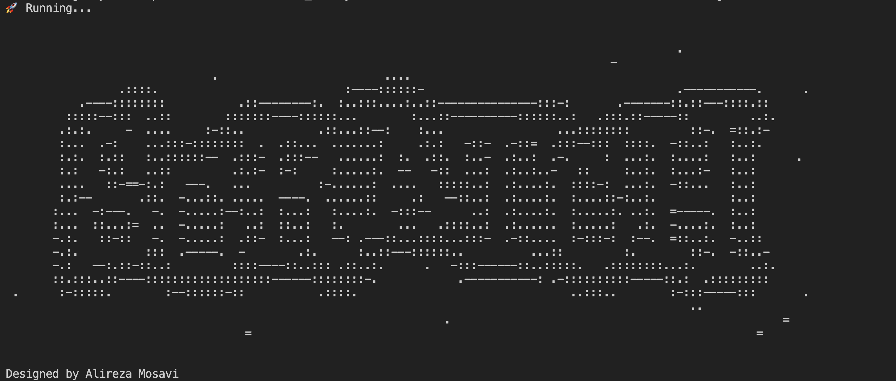
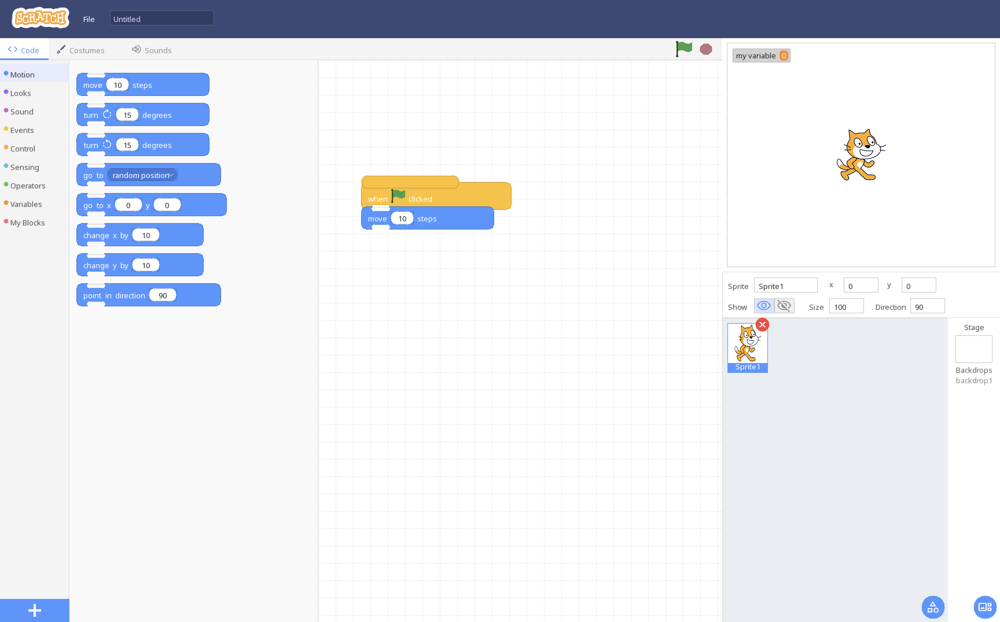
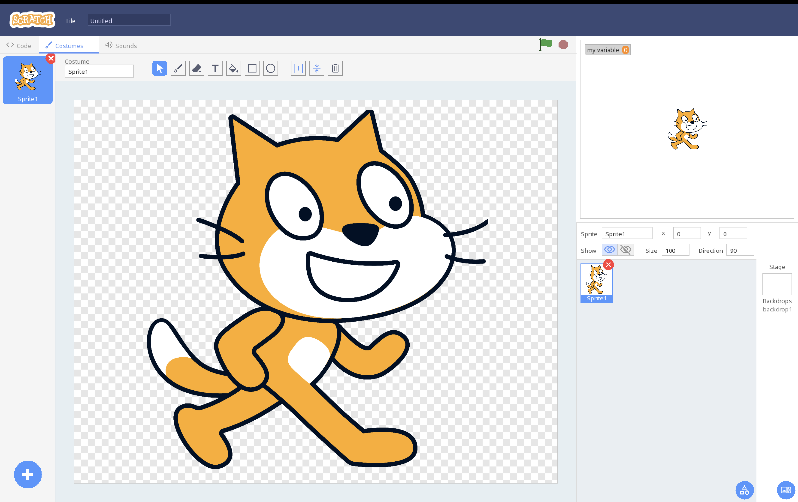
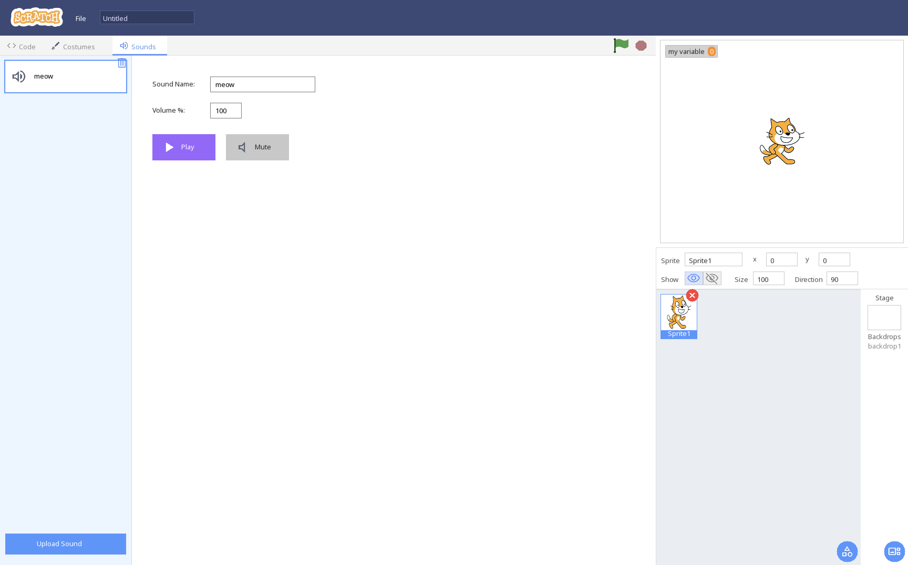
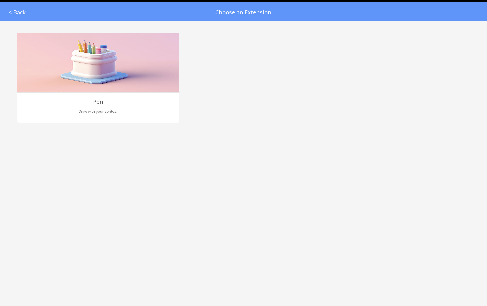
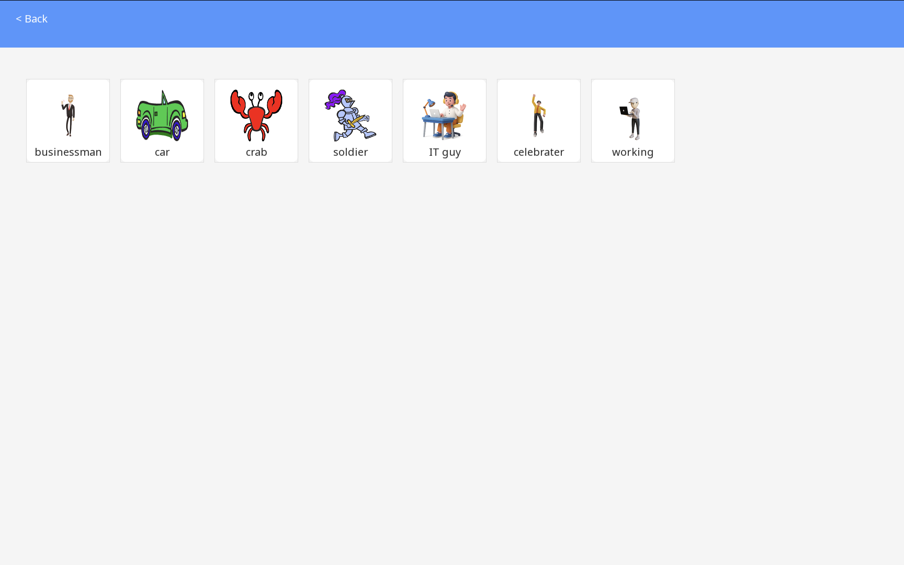

<p align="center">
  
  
  
  
</p>

<h1 align="center">🧩 Sloggy</h1>
<h3 align="center">A Scratch-Inspired Visual Programming Environment</h3>
<p align="center">
  <em>Built from scratch in C++ with SDL2 — no frameworks, no shortcuts.</em>
</p>

---

## 👤 Author

**Alireza Mosavi** — Solo Developer

> This entire project was designed, implemented, and tested by me alone as the final project for the **Fundamentals of Programming** course. Every part — from the custom block renderer to the Scratch-style interpreter and UI — was written by hand in C++.

---

## 📖 About

**Sloggy** is a desktop visual programming environment inspired by [MIT Scratch](https://scratch.mit.edu). It’s built entirely in **C++17** using the **SDL2** ecosystem and includes:

- A drag-and-drop block editor with snapping
- A real-time sprite stage (Scratch-like coordinates)
- A cooperative “script threads” interpreter (concurrent scripts like Scratch)
- A built-in costume editor and sound manager
- Pen extension + color sensing
- Project save/load (JSON)

No web technologies, no engine frameworks — just SDL2 + C++.

---

## ✨ Features at a Glance

| Feature | Description |
|---------|-------------|
| 🎨 **Visual Block Editor** | Drag-and-drop blocks with snapping for stacks, C-shapes, reporters, and boolean slots |
| 🏃 **Runtime Engine** | Scratch-style concurrent scripts (per-script stacks advanced every frame) with waits, loops, and conditionals |
| 🎭 **Sprite System** | Multiple sprites with costumes, layers, visibility, size, and direction |
| 🖌️ **Costume Editor** | Built-in paint tools and editing workflow for sprite costumes |
| 🔊 **Sound Manager** | Start/stop sounds, “play until done”, and per-project volume controls |
| 🖊️ **Pen Extension** | Pen up/down, stamp, erase all, pen size, plus color/saturation/brightness controls |
| 🧱 **Custom Blocks (My Blocks)** | Create custom functions with up to **3 parameters** and call them like Scratch |
| 📊 **Variables** | Create variables and use them in scripts; variable monitors can be shown on the stage |
| 🐛 **Debugger & Safety** | Execution highlighting, watchdog for infinite loops, and a file logger (`logs/logs.txt`) |
| 💾 **Save / Load** | Full project serialization to `projects/<ProjectName>/project.json` (plus saved paint assets) |
| 📡 **Broadcasting** | `broadcast` + `when I receive` for event-driven scripts |

---

## 🎮 Block Categories (Implemented)

### Motion
`move` · `turn right` · `turn left` · `go to (random / mouse)` · `go to x y` · `change x by` · `change y by` · `point in direction`

### Looks
`say` / `say for` · `think` / `think for` · `switch costume to` · `next costume` · `switch backdrop to` · `next backdrop` · `set size to` · `change size by` · `show` / `hide` · `go to layer` · `go layers`  
Reporters: `size` · `costume` · `backdrop`

### Sound
`start sound` · `play sound until done` · `stop all sounds` · `set volume to` · `change volume by`

### Events
`when flag clicked` · `when key pressed` · `when sprite clicked` · `broadcast` · `when I receive`

### Control
`wait` · `repeat` · `forever` · `if` · `if else` · `wait until` · `repeat until`

### Sensing
`touching` · `touching color` · `color is touching color` · `key pressed` · `mouse down` · `mouse x` · `mouse y` · `distance to` · `ask and wait` · `answer` · `set drag mode`

### Operators
`+` `-` `*` `/` · `>` `<` `=` · `and` `or` `not` · `join` · `letter of` · `length of`

### Variables
Variable reporters (per variable) · `set` · `change`

### My Blocks (Custom Functions)
`Make a Block` → define a function · call your function as a block · parameter reporters (supports up to **3** params)

### Pen Extension
`erase all` · `stamp` · `pen down` · `pen up` · `set pen color to` · `change pen color by` · `set pen color to` · `change pen size by` · `set pen size to`

---

## 🛠️ Tech Stack

| Component | Technology |
|-----------|-----------|
| Language | C++17 |
| Windowing & Rendering | SDL2 |
| Image Loading | SDL2_image |
| Font Rendering | SDL2_ttf |
| Audio Playback | SDL2_mixer |
| Build System | Makefile |

---

## 📂 Project Structure

```
assets/
├── backdrops/        Built-in backdrops
├── sprites/          Built-in sprites
├── sounds/           Default sounds
├── fonts/            UI fonts
├── icons/            UI icons
├── extensions/       Extension icons
└── hero/             Misc/hero assets

logs/
└── logs.txt          Runtime logger output (created/overwritten on run)

src/
├── main.cpp              # Application entry point + main loop
├── app.cpp/h             # App state + high-level wiring
├── config.cpp/h          # Window/layout constants
├── textures.cpp/h        # Texture loading + caching
├── renderer.cpp/h        # Low-level drawing primitives
├── blocks.cpp/h          # Block palette + definitions
├── block_ui.cpp/h        # Block rendering (shapes/labels)
├── palette.cpp/h         # Category sidebar & palette UI
├── workspace.cpp/h       # Drag/drop, snapping, inputs, block graph
├── interpreter.cpp/h     # Runtime interpreter (Scratch-style script threads)
├── stage.cpp/h           # Stage rendering, sprites, variable monitors
├── sprite_panel.cpp/h    # Sprite management UI
├── costumes_tab.cpp/h    # Costume editor UI
├── sounds_tab.cpp/h      # Sound manager UI
├── navbar.cpp/h          # Top navigation bar
├── tab_bar.cpp/h         # Tabs for Code / Costumes / Sounds
├── categories.cpp/h      # Category headers
├── drag_area.cpp/h       # Drag overlay area
├── filemenu.cpp/h        # Save/Load to JSON under projects/
├── logger.cpp/h          # System logger + toast notifications
└── dotenv.cpp/h          # Optional .env loader (DEBUG_MODE, etc.)
```

---

## 🚀 Getting Started

### Prerequisites

You need a C++17 compiler, `make`, and these SDL2 packages:

- SDL2
- SDL2_image
- SDL2_ttf
- SDL2_mixer
- pkg-config (used by the Makefile)

**macOS (Homebrew)**

```bash
brew install sdl2 sdl2_image sdl2_ttf sdl2_mixer pkg-config
```

**Ubuntu / Debian**

```bash
sudo apt update
sudo apt install -y build-essential pkg-config \
  libsdl2-dev libsdl2-image-dev libsdl2-ttf-dev libsdl2-mixer-dev
```

**Windows (MSYS2 / MinGW)**  
Install SDL2 + extensions for MinGW and ensure `pkg-config` can find them, then build from the MSYS2 shell.

---

### Build & Run (Makefile)

```bash
make
./scratch_clone
```

Quick run (clean → build → run):

```bash
./init.sh
```

---

## 🎮 Controls

| Key / Action | Function |
|-------------|----------|
| 🖱️ **Drag** | Drag blocks from the palette into the workspace |
| 🏳 **Green Flag** | Start all scripts that begin with a hat/event block |
| 🛑 **Stop** | Stop running scripts |
| ⌨️ **Type in fields** | Click white inputs/capsules to type values |
| **Keyboard keys** | Trigger `when key pressed` |
| **Click stage sprite** | Trigger `when sprite clicked` |

---

## 🐛 Debugging & Safety

### Execution Highlighting
While running, the currently executing block is highlighted. Watchdog/logic errors can mark the active block for easier debugging.

### Watchdog (Infinite Loop Protection)
A watchdog stops a script tick after a high number of block-steps (prevents freezes during `forever` / `repeat`).

### System Logger
All major runtime actions (events, block execution, errors) are logged to:

- `logs/logs.txt`

---

## 🏗️ Architecture Highlights

### Interpreter (Scratch-Style Concurrency)
Each hat/event script runs as its own **script thread** (a separate execution stack). The interpreter advances each thread incrementally every frame, yielding for waits/conditions — giving Scratch-like concurrency without relying on OS threads.

### Block Snapping & Graph
The workspace maintains block connections (stacks, C-shapes, boolean slots, reporters). Reporters snap into value capsules and boolean blocks snap into condition slots.

### Pen Layer & Color Sensing
Pen strokes render onto a dedicated render target texture, composited with the stage. Color sensing uses pixel reads from the rendered stage to implement `touching color` and related blocks.

### Custom Functions (My Blocks)
Custom function definitions are stored as `My Blocks` and can be called like normal stack blocks. Parameters are supported (up to **3**), with parameter reporter blocks usable inside the function body.

---

## 📸 Screenshots

<p align="center">
  
</p>

<p align="center">
  
</p>

<p align="center">
  
</p>
<p align="center">
  
</p>
<p align="center">
  
</p>
<p align="center">
  
</p>


---

## 📝 Course Information

- **Course:** Fundamentals of Programming
- **Project Type:** Final Project (Solo)
- **Developer:** Alireza Mosavi

---

## 📄 License

MIT License — see `LICENSE`.

---

<p align="center">
  <em>Built with ❤️ and an unreasonable amount of SDL_RenderCopy.</em>
</p>
